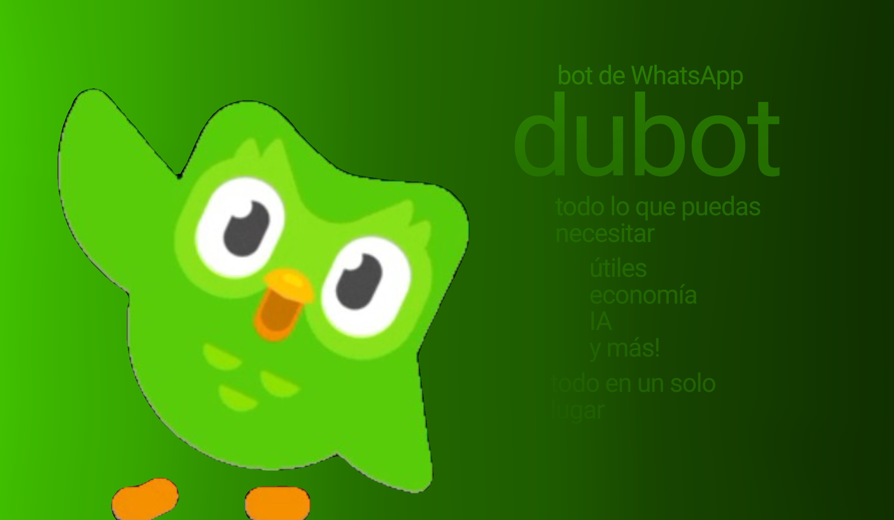

# 🦉 DUbot — Bot Multifunción para WhatsApp

<div align="center">



<br/>

<a href="https://nodejs.org/"></a>
<a href="https://github.com/WhiskeySockets/Baileys"></a>
<a href="https://ai.google.dev/"></a>
<a href="https://github.com/doodle1duo/duBoT-WA-bot"></a>

<a href="https://github.com/doodle1duo/duBoT-WA-bot"></a>

<p align="center">
  <b>El bot para WhatsApp más completo, modular y optimizado en Node.js (Baileys ESM).<br>
  Equipado con Halloween Gacha RC & Duolingo Exclusivos por Pity con Contador de Unidades en Serie, Super Admin Abuse y Animaciones en Tiempo Real (.anim), Gran Especial de Halloween 🎃 (Truco o Trato, Caldero Mágico, Mansión Embrujada, Cazafantasmas), Juegos Interactivos HTML Canvas (Ajedrez, Blackjack, Asalto al Banco), Sistema de Mascotas & Huevos con Duolingo Mítico x100, Rework VIP con Cashback, Casa de Subastas .ah, Sub-Bots Jadibots, Balatro Poker Roguelike, IA Gemini y Duelos PvP.</b>
</p>

<p align="center">
  <a href="https://wa.me/56985529966?text=Hola%20Chile%20Pesos%2C%20quiero%20conseguir%20el%20bot%20DUbot%20para%20mi%20WhatsApp">⚡ <b>Conseguir Bot por WhatsApp</b></a> •
  <a href="#-lista-completa-de-comandos">📋 <b>Lista de Comandos</b></a> •
  <a href="#-1-instalación-en-android-termux">📱 <b>Guía Termux</b></a> •
  <a href="#-2-instalación-en-linux--vps-ubuntudebian">🐧 <b>Guía Linux / VPS</b></a>
</p>

</div>

---

## 📑 Tabla de Contenidos
- [🌟 Características Destacadas](#-características-destacadas)
- [🚀 Guías de Instalación y Despliegue](#-guías-de-instalación-y-despliegue)
  - [📱 1. Instalación en Android (Termux)](#-1-instalación-en-android-termux)
  - [🐧 2. Instalación en Linux / VPS (Ubuntu/Debian)](#-2-instalación-en-linux--vps-ubuntudebian)
  - [🪟 3. Instalación en Windows](#-3-instalación-en-windows)
  - [🔄 4. Ejecución 24/7 en Segundo Plano con PM2](#-4-ejecución-247-en-segundo-plano-con-pm2)
- [🔑 Configuración de la API Key de Gemini](#-configuración-de-la-api-key-de-gemini)
- [📱 Métodos de Vinculación](#-métodos-de-vinculación-con-whatsapp)
- [📋 Lista Completa de Comandos](#-lista-completa-de-comandos)
- [⚙️ Configuración y Administradores](#️-configuración-y-administradores)
- [❓ Preguntas Frecuentes & Solución de Problemas](#-preguntas-frecuentes--faq)
- [👑 Creador & Contacto](#-información-del-creador)

---

## 🌟 Características Destacadas

### 🎴 1. Gacha Rollchar de Halloween & Duolingo Exclusivos por Pity (v2.1.0)
* **🎃 Categoría Especial 8★ Exclusiva (`.rollchar` / `.rc`):** 5 personajes de Halloween de Duolingo con arte e ilustraciones vectoriales de alta resolución:
  * 🎃 **Duolingo Calabaza Maldita:** Poseído por la llama eterna de Jack-o'-lantern.
  * 🧛 **Conde Duolingo Vampiro:** Se alimenta de las gemas de quienes rompen su racha.
  * 🧙‍♀️ **Duolingo Brujo del Caldero:** Hierve lágrimas de estudiantes en su caldero mágico.
  * 👻 **Duolingo Fantasma Espectral:** Traspasa paredes a las 3:00 AM para exigir lecciones pendientes.
  * 💀 **Duolingo Segador de Almas:** Porta una guadaña esmeralda cosechando almas de notificaciones ignoradas.
* **🔒 Exclusividad Absoluta por Pity (Cada 20 Tiradas):** Estos personajes **NUNCA** pueden salir por tirada aleatoria normal (0% probabilidad RNG); se consiguen **única y exclusivamente** al acumular 20 tiradas en el contador `🎃 Pity Halloween (20 Tiradas)`.
* **🏷️ Contador de Unidad en Serie (#001, #002...):** Cada unidad acuñada recibe un número de serie único a nivel de servidor y muestra el total de existencias en circulación mundial.
* **🎒 Compatibilidad Total:** Muestra las unidades en `.mispers` y se pueden comercializar con su número de serie en la Casa de Subastas (`.ah sell` / `.ah buy`).

### 🎃 2. Calabaza Coleccionable de la Tienda & Tasación de Mercado (v2.1.0)
* **🛒 Adquisición en `.shop` (`.comprar calabaza`):** Objeto puramente coleccionable y trofeo de exhibición (no consumible, precio $2,500).
* **🏷️ Número de Serie Único:** Cada calabaza recibe un número de serie secuencial e irrepetible (`#1`, `#2`, `#3`...). A menor número de serie, mayor es su valor base y exclusividad en el mercado (hasta x10 para la `#1`).
* **🔒 Primer Dueño Sellado:** En el momento de la compra, el primer comprador queda sellado de forma indeleble y permanente (`originalOwner`). Si el primer dueño fue un administrador del bot (`+150%`) o una persona famosa/top de riqueza (`+75%`), la pieza adquiere una prima de valor histórica que se mantiene para siempre aunque se regale.
* **✍️ Firmas y Autógrafos (`.firmarcalabaza <serial> <mensaje>`):** Cualquier usuario puede dejar una dedicatoria o autógrafo en la calabaza.
* **📉 Regla de Intercambio en Números Bajos:** Si una calabaza de número de serie bajo (`#1` a `#25`) recibe firmas de administradores o personas famosas, **su valor de intercambio disminuye** debido a que los autógrafos rayan y alteran el estado prístino inmaculado de la pieza de colección. En piezas de series comunes, las firmas de celebridades incrementan su valor comercial.
* **📜 Comandos de Colección:**
  * `.miscalabazas` / `.calabazas`: Muestra el catálogo de calabazas del jugador con tasación en tiempo real.
  * `.calabaza info <serial>`: Muestra el Certificado Oficial de Autenticidad, poseedor actual, primer dueño sellado, firmas y desglose.
  * `.tasarcalabaza <serial>`: Tasación analítica de mercado con detalle de factores y deducciones.
  * `.regalarcalabaza @usuario <serial>`: Transfiere la posesión a otro usuario conservando el sello del primer dueño intacto.

### 🏆 3. Gran Expansión de Logros & Sistema Silencioso Anti-Spam (v2.1.0)
* **🔇 Notificaciones Silenciosas:** Las recompensas de los logros (dinero, XP y créditos) se acreditan automáticamente en segundo plano sin interrumpir ni spamear mensajes emergentes durante el juego o actividades como `.work`, `.minar` o el casino.
* **📋 Resumen de Novedades en `.logros`:** Al consultar `.logros`, el bot muestra un banner destacado con los logros desbloqueados recientemente y luego limpia la cola pendiente.
* **⭐ 25 Logros Totales:** Incluye hitos de calabaza (`calabaza_coleccion`, `calabaza_prestigio`, `calabaza_firmada`), Halloween Gacha (`duo_halloween`), economía multimillonaria, jackpot de casino, robos al banco, mascotas míticas y ajedrez.

### 🚫 4. Sistema de Baneo Integral del Bot (`.banuser` / `.unbanuser`)
* **⚖️ Sanción Centralizada de Administrador:** Permite a los administradores del bot revocar permanentemente el acceso a cualquier usuario infractor (`.banuser @user [motivo]`, `.ban`, `.botban`, `.bloquear`).
* **🛡️ Protección:** El bot no puede ser baneado a sí mismo ni se puede banear a administradores del bot.
* **🔓 Desbaneo Oficial:** `.unbanuser @user` para restaurar el acceso.

### ⏳ 5. Super Admin Abuse con Animaciones en Tiempo Real (v2.0.0)
* **🎬 Animaciones Interactivas en Vivo (`.anim [tipo] [tiempo] [texto]`):** Sistema de animación que actualiza y edita en vivo el mensaje en WhatsApp (intervalo seguro de 1.5s - 2.5s) con duración personalizada (`10s`, `30s`, `1m`, `2m30s`, etc.):
  * ⏳ **Reloj de Arena (`.anim reloj`):** Física de arena cayendo entre compartimentos con barra de progreso y cuenta regresiva.
  * 💣 **Bomba Dinamita (`.anim bomba`):** Mecha encendida que se consume hasta una explosión `💥 BOOOOM 💥`.
  * 📦 **Cofre del Tesoro (`.anim cofre`):** Cofre misterioso con 3 candados que se van forzando uno a uno hasta revelar el tesoro.
  * 🎰 **Tragamonedas en Vivo (`.anim slots`):** Rodillos de casino girando en tiempo real hasta frenar y alinear el jackpot de diamantes.
  * ⚡ **Terminal Hacker (`.anim hack`):** Consola estilo Matrix inyectando exploits con registros de bypass de seguridad.
  * 🚀 **Cohete Espacial (`.anim cohete`):** Secuencia de encendido, conteo regresivo T-minus y despegue a órbita.
  * 🌧️ **Lluvia Interactiva de Dinero (`.anim lluvia`):** Nubes arrojando billetes en vivo con un pozo acumulativo donde **los jugadores del grupo pueden escribir `.recoger` en tiempo real** para llevarse el dinero.
* **🛑 Control Total:** Detén cualquier animación activa con `.anim stop` o consulta el catálogo con `.anim lista`.

### 🏦 2. Asalto al Banco Central & Sistema de Bolsas (v1.8.0)
* **🛍️ Catálogo de Bolsas (`.bolsa` / `.bolsa comprar [id]`):** Tu capacidad de botín depende de la bolsa equipada. Catálogo con Bolsa de Plástico ($10K), Mochila Escolar ($50K), Bolsa Deportiva ($200K), Maletín Blindado ($1M), Saco Reserva Federal ($3M) y Bolsa Admin ($10M).
* **👥 Asalto Cooperativo y en Solitario (`.robarbanco` / `.heist`):** Planifica el golpe al banco. Se abre un lobby de 40s donde tus amigos pueden sumarse con `.unirse` (hasta 6 cómplices) o el líder puede iniciar de inmediato con `.iniciarrobo`.
* **🕹️ 3 Minijuegos Tácticos Secuenciales:**
  1. 💻 **Hackeo de Cámaras y Sensores:** Ingresa el PIN antes de 25s (`.hack [PIN]`).
  2. ⚡ **Forzar la Bóveda de Titanio:** Analiza el reporte infiltrado y corta el cable eléctrico correcto (`.cortar 1|2|3`).
  3. 🚓 **La Gran Fuga:** Intercepta la radio policial SWAT y elige la ruta de escape despejada (`.ruta A|B|C`).
* **💰 Botín al 100% de la Bolsa:** Si completan los 3 minijuegos, todos los participantes llenan su bolsa al 100% en efectivo.
* **🚔 Cárcel, Multa Severa & Congelamiento de Cuenta:** Si la banda fracasa, todos van a prisión con una multa equivalente al tamaño de su bolsa y sus cuentas bancarias quedan bloqueadas por 1 hora completa (no se permite retirar con `.with`).

### 🎃 2. Set Temporal de Halloween & Noche de Brujas (Octubre)
* **🍬 Truco o Trato (`.dulceotruco` / `.trickortreat`):** Toca puertas en el vecindario oscuro pidiendo caramelos, chocolates mágicos y monedas o recibe sustos cómicos.
* **🧙‍♀️ Tienda de la Bruja & Caldero (`.caldero` / `.pociones`):** Compra consumibles mágicos (dulce de calabaza, poción de la bruja, alas de murciélago, esencia fantasmal, manzana envenenada, elixir de vampiro). Incluye minijuego de aprendiz de brujo (`.caldero preparar`).
* **🏚️ Mansión Embrujada (`.casadelterror` / `.mansion`):** Explora los 15 pisos de la mansión del terror junto a tu grupo para llevarte el pozo acumulado del fantasma ($15,000+), la Calabaza Dorada y pociones de inmortalidad.
* **👻 Cazafantasmas (`.cazafantasmas [monto]`):** Dispara tu rayo de protones para capturar espectros y poltergeists con precisión (hasta x5 de ganancia).
* **🔪 Tallar Calabazas (`.calabaza [monto]`):** Talla tu Jack-o'-lantern artística por grandes premios del jurado (hasta x3.5).
* **📜 Duelo de Hechizos (`.hechizo [@user]`):** Lanza conjuros mágicos en verso o sella pactos de hechicería con amigos para ganar recompensas.
* **🧟 Carrera Zombie (`.carrerazombie`):** Escapa de la horda zombie atravesando el cementerio a toda velocidad.
* **🎃 Evento Global/Local de Halloween (`.event halloween`):** Multiplicador x3 en trabajo y diario, ⚡ **0 COOLDOWN ACTIVO AUTOMÁTICAMENTE**, lluvia de dulces ($100-$1000 por mensaje) y Seguro Total en casino.
* **⚡ Evento 0 Cooldown (`.event 0cooldown [tiempo]`):** Elimina el tiempo de espera a 0 segundos en `.work`, `.daily`, `.weekly`, `.monthly`, `.minar`, `.pescar`, `.cazar`, `.rob`, `.rollchar` y `.caldero`.

### 🐾 2. Sistema de Mascotas (Pets) & Huevos (v1.5.0)
* **Incubación de Huevos (`.huevo`):** Adquiere e incuba huevos por categoría (Común $5k, Raro $25k, Épico $100k y Legendario $1M).
* **🦉 Duolingo Mítico:** Mascota secreta con 1% de probabilidad en el huevo legendario. Otorga una habilidad pasiva del **20% al 30% de ganar x100 monedas** en `.work`.
* **🎒 Hasta 6 Slots de Equipamiento (`.pet slots`):** Desbloquea espacios adicionales con monedas para equipar múltiples mascotas simultáneamente y combinar todos sus bonos pasivos.
* **🍖 Alimentación & Niveles (`.pet alimentar`):** Sube a tus mascotas dándoles carne, pescado o monedas para potenciar sus estadísticas.
* **🔮 Renacimiento de Mascotas / Rebirth (`.pet renacer`):** Al alcanzar el nivel máximo, paga una cuota de monedas para renacer a tu mascota: vuelve a Nivel 1 pero amplía permanentemente su capacidad en **+10 niveles adicionales** (Nv.20, Nv.30, Nv.40...) potenciando sus habilidades a niveles legendarios.

### 👑 2. Rework Integral del Sistema VIP (v1.5.0)
* **Panel de Membresía (`.vip`):** Consulta en tiempo real tus rangos, tiempo restante de Tarjeta VIP y el desglose de todos los beneficios activos.
* **🎟️ Tarjeta VIP 24h (`.shop` / `.use vip`):** Cooldown de trabajo a 1 min, +50% dinero en todo, +0.50 suerte, +50% XP y 50% probabilidad de evadir robos.
* **🎖️ Rangos VIP / Elite / Supremo (`.roles`):** Incluyen slots de mascota gratis, multiplicadores permanentes de dinero, suerte duplicada y hasta 25% de cashback en casino.

### 🏛️ 3. Casa de Subastas / Mercado de Personajes (v1.5.0)
* **Comercio Libre (`.ah`):** Publica tus personajes coleccionables de Patapon al precio que desees (`.ah sell`) para que otros usuarios los compren (`.ah buy`).
* **Venta Rápida al Bot (`.ah quicksell`):** Liquida personajes duplicados instantáneamente por dinero en efectivo según su rareza de estrellas.

### 📢 4. Transmisión Global Oculta & Eventos Multigrupo (v1.4.0)
* **Difusión Global Invisible (`.globalmsg [mensaje]`):** Envía comunicados oficiales a todos los grupos registrados donde el bot ha interactuado, con mención invisible/oculta a todos sus miembros.
* **Eventos con Transmisión Automática (`.event` / `.endevent`):** Al activar o finalizar un evento global, todos los grupos reciben el anuncio con etiqueta oculta.
* **Duración en Minutos u Horas:** Especifica tiempos flexibles como `.event luck 30m`, `.event work 45min` o `.event casino 2h`.
* **Registro Persistente:** Mapeo automático de grupos en base de datos con intervalo anti-ban de 1.5s entre envíos.

### 🃏 2. Balatro Roguelike Poker en ASCII (v1.3.1)
* Adaptación completa del roguelike de póker **Balatro** con visualización ASCII compacta optimizada para pantallas móviles.
* **30 Jokers únicos:** Multiplicadores aditivos, multiplicadores exponenciales ($\times\text{Mult}$), fichas planas y Jokers de escala.
* **9 Cartas de Planeta:** Sube de nivel las combinaciones de póker (Pareja, Doble Pareja, Trío, Escalera, Color, Full House, Póker, Escalera de Color, Escalera Real).
* **8 ANTES con 3 Ciegas cada uno:** Small Blind, Big Blind y Boss Blinds con efectos de debuff especiales.
* **Tienda interactiva entre rondas:** Compra y vende Jokers, Planetas y realiza rerolls de tienda.
* Comandos: `.balatro`, `.bltr`, `.bplay`, `.bdiscard`, `.bshop`, `.bnext`, `.binfo`.

### 🤖 2. Sistema Jadibot Multisesión con Prefijos Libres (v1.3.1)
* Convierte cualquier número de WhatsApp en un **sub-bot activo e independiente** en segundos.
* Vinculación rápida mediante **código de 8 dígitos** o escaneo de **código QR**.
* **Prefijos totalmente personalizados:** Asigna letras (`b.`, `c.`) o símbolos (`!`, `#`, `$`, `/`, `?`, etc.) al momento de vincular.
* **Ejecución directa instantánea:** Sin confirmaciones molestas al usar el prefijo asignado.
* **Aviso inteligente de prefijo:** Si alguien usa `.` en un sub-bot con prefijo propio, recibe una notificación con su prefijo correcto.
* **Auto-Reconexión inteligente:** Si el servidor se reinicia, todos los sub-bots vinculados se restauran automáticamente.

### 🛡️ 2. Administración y Moderación de Grupos (v1.3.0 & v2.1.0)
* **🔇 Silenciamiento Activo con Eliminación Inmediata (`.mute` / `.mutear`):**
  * `.mute @user [duración] [motivo]` (o respondiendo al mensaje del usuario).
  * Soporta duraciones personalizadas (`30s`, `10m`, `1h`, `1d`) o mute permanente.
  * **Eliminación Automática:** Cada vez que el usuario muteado envía un mensaje en el grupo, **el bot lo elimina automáticamente de inmediato** de forma transparente, sin registrar historial ni ejecutar comandos.
* **🔊 Desilenciamiento (`.unmute` / `.desmutear`):** Restaura los privilegios para que el usuario pueda escribir nuevamente con normalidad.
* **📋 Lista de Muteados (`.muted` / `.muteados`):** Consulta todos los miembros silenciados en el grupo, con tiempo restante, motivo y el administrador sancionador.
* **🌐 Mute Global (`.muteglobal` / `.unmuteglobal`):** Comando exclusivo de administradores del bot para silenciar a un infractor en todos los grupos donde el bot esté presente.
* **Invocación Masiva (`.tagall`):** Menciona a todos los miembros del grupo con formato visual elegante.
* **Notificación Oculta (`.hidetag`):** Transmite mensajes a todos los integrantes sin saturar el chat de menciones visibles.
* **Expulsión (`.kick`):** Retira usuarios infractores con validación de permisos de admin.
* **Información del Grupo (`.infogrupo`):** Muestra creador, fecha de creación, recuento de miembros, administradores y descripción.
* **Enlace de Invitación (`.link`):** Obtén el link oficial del grupo directamente.

### ⚔️ 3. Sistema de Duelos PvP con Apuestas (v1.3.0)
* Desafía a otros usuarios a duelo a muerte por dinero (`.duelo @user [monto]`).
* Interfaz de combate por turnos con aceptación (`.aceptar`) y rechazo (`.rechazar`).
* Cálculo dinámico de puntuación de combate basado en **nivel, suerte y herramientas forjadas** (ej. Pico de Hierro).
* El ganador se lleva el pozo de apuestas ($2x) y experiencia extra (XP).

### 🎙️ 4. Text-To-Speech (TTS) — Notas de Voz Reales (v1.3.0)
* Convierte cualquier texto a nota de voz interactiva de WhatsApp (`.tts [texto]` / `.voz`).
* Soporta múltiples idiomas: español (`es`), inglés (`en`), portugués (`pt`), francés (`fr`), japonés (`ja`), etc.
* Compatible con citas: responde a cualquier mensaje largo con `.tts` para escucharlo como audio.
* Codificación nativa a **OGG Opus** para visualización de ondas de audio en WhatsApp.

### 🌤️ 5. Clima en Tiempo Real & Calculadora Inteligente (v1.3.0)
* **Clima Satelital (`.clima [ciudad]`):** Temperatura, sensación térmica, humedad, viento, índice UV y estado del cielo en tiempo real.
* **Calculadora Segura (`.calc [expresión]`):** Resuelve sumas, restas, productos, divisiones, potencias `^`, raíces cuadradas `sqrt()`, funciones trigonométricas y constantes ($\pi$, $e$).

### 💰 6. Economía Completa, Bóveda Bancaria & Préstamos
* Moneda virtual (`$`) con bóveda bancaria (`.dep`, `.with`) e intereses diarios.
* Recompensas progresivas por trabajo y fidelidad (`.work`, `.daily`, `.weekly`, `.monthly`).
* Préstamos bancarios con interés y vencimiento a 7 días (`.prestamo`, `.deuda`, `.pagardeuda`).
* Sistema de rescate de deudas: paga la fianza de amigos encarcelados (`.cubrirdeuda @user`).
* Robos entre usuarios (`.rob`) con probabilidad de ser arrestado y multas con minijuego de rescate (`.rescate`).
* Ranking global de multimillonarios (`.top`).

### ⛏️ 7. Minería, Pesca, Caza & Forja de Crafteo
* Recolección de materiales (Madera, Hierro, Orbe Místico, Pluma Sagrada, Piedra, Pescado, Carne).
* Sistema de **Forja y Crafteo** (`.crafteo`): Fabrica el Pico de Hierro (+50% en minería), Caña Reforzada (peces raros) y el Protector de Racha.

### 🎴 8. Gacha RPG Patapon & Sistema de Pities
* Más de 40 personajes coleccionables organizados por rarezas (Común 1★ hasta Duolingo Secreto 7★).
* Sistema de **Pity garantizado**:
  * 15 tiradas: 5★ Legendario
  * 30 tiradas: 6★ Mítico
  * 50 tiradas: 7★ Secreto
* Tienda de Créditos Patapon (`.tiendachar`) para canjear duplicados.

### 🎰 9. Casino Completo & Minijuegos
* **Blackjack vs Bot (`.blackjack`)** con crupier automático.
* **Ruleta (`.roulette`)**, **Tragamonedas (`.slots`)**, **Dados (`.dice`)**, **Cara o Cruz (`.cf`)**.
* **Ruleta Rusa (`.ruletarusa`)** de alto riesgo y **Ruleta de Expulsión (`.ruletaexpulsion`)**.
* **Apuestas de Personas (`.apostarpersona @user`)**: Si pierdes, tu amigo va a la cárcel.
* **Lotería Global Acumulativa (`.loteria`)** con pozo millonario.

### 🧠 10. Inteligencia Artificial (Google Gemini & Imagen 4.0)
* Conversación fluida con memoria de contexto de grupo (`.ai [pregunta]` o citando).
* **Generación de Imágenes fotorrealistas (`.ai genera una imagen de [...]`)** con Imagen 4.0.
* **Torneos de Debates con Juez IA (`.debate`)**: Juez artificial evalúa argumentos y declara ganadores con apuestas en vivo de espectadores.

### 📡 11. Inter-Chat Virtual (IV)
* Conexión privada 1 a 1 entre usuarios de distintos grupos (`.iv conectar @user`).
* Creación de salas virtuales de conferencia (`.iv crear [sala]`, `.iv unirse [código]`).

---

## 🚀 Guías de Instalación y Despliegue

### 📱 1. Instalación en Android (Termux)

> [!TIP]
> Instala Termux preferentemente desde [F-Droid](https://f-droid.org/es/packages/com.termux/) para asegurar compatibilidad total con los paquetes actualizados.

Ejecuta los siguientes comandos uno por uno en la consola de Termux:

```bash
# 1. Actualizar repositorios y paquetes base
pkg update -y && pkg upgrade -y

# 2. Otorgar permisos de almacenamiento a Termux
termux-setup-storage

# 3. Instalar Node.js LTS, Git, FFmpeg y Python
pkg install nodejs-lts git ffmpeg python -y

# 4. Clonar el repositorio oficial
git clone https://github.com/doodle1duo/duBoT-WA-bot.git

# 5. Entrar a la carpeta del bot
cd duBoT-WA-bot

# 6. Instalar dependencias del proyecto
npm install

# 7. Configurar tu API Key de Gemini (Opcional si la ingresas en consola)
export GEMINI_API_KEY="tu_api_key_aqui"

# 8. Iniciar el bot
node bot.js
```

---

### 🐧 2. Instalación en Linux / VPS (Ubuntu/Debian)

Compatible con servidores VPS (Ubuntu 20.04/22.04/24.04, Debian 11/12, etc.):

```bash
# 1. Actualizar el sistema
sudo apt update && sudo apt upgrade -y

# 2. Instalar paquetes esenciales y FFmpeg
sudo apt install -y git curl wget ffmpeg build-essential

# 3. Instalar Node.js 20 LTS vía NodeSource
curl -fsSL https://deb.nodesource.com/setup_20.x | sudo -E bash -
sudo apt install -y nodejs

# 4. Verificar versiones de Node y NPM
node -v
npm -v

# 5. Clonar el proyecto
git clone https://github.com/doodle1duo/duBoT-WA-bot.git
cd duBoT-WA-bot

# 6. Instalar dependencias de producción
npm install

# 7. Configurar la API Key de Gemini como variable de entorno permanente
echo 'export GEMINI_API_KEY="tu_api_key_aqui"' >> ~/.bashrc
source ~/.bashrc

# 8. Iniciar el bot en primer plano
node bot.js
```

---

### 🪟 3. Instalación en Windows

1. Descarga e instala **[Node.js LTS (v18 o v20)](https://nodejs.org/)**.
2. Descarga e instala **[Git para Windows](https://git-scm.com/)**.
3. Abre **PowerShell** o **CMD** como Administrador y ejecuta:

```powershell
# 1. Clonar el repositorio
git clone https://github.com/doodle1duo/duBoT-WA-bot.git

# 2. Entrar a la carpeta
cd duBoT-WA-bot

# 3. Instalar dependencias
npm install

# 4. Configurar variable de entorno (PowerShell)
$env:GEMINI_API_KEY="tu_api_key_aqui"

# 5. Iniciar el bot
node bot.js
```

---

### 🔄 4. Ejecución 24/7 en Segundo Plano con PM2

Para mantener el bot ejecutándose las 24 horas del día sin interrupciones (incluso tras reiniciar el servidor o cerrar la terminal):

```bash
# 1. Instalar PM2 globalmente
npm install -g pm2

# 2. Iniciar DUbot con PM2
pm2 start bot.js --name "dubot"

# 3. Guardar la lista de procesos para auto-inicio al reiniciar el sistema
pm2 save
pm2 startup

# 4. Comandos útiles de PM2:
pm2 logs dubot       # Ver la consola en tiempo real
pm2 restart dubot    # Reiniciar el bot
pm2 stop dubot       # Detener el bot
pm2 status           # Ver estado del bot y consumo de memoria
```

---

## 🔑 Configuración de la API Key de Gemini

DUbot utiliza la tecnología de **Google Gemini** para procesamiento conversacional, juez de torneos y generación de imágenes.

1. Ingresa a **[Google AI Studio](https://aistudio.google.com/)**.
2. Inicia sesión con tu cuenta de Google y haz clic en **"Get API key"** > **"Create API key"**.
3. Copia tu clave generada.
4. Puedes configurarla de dos formas:
   * **Variable de entorno:** `export GEMINI_API_KEY="tu_clave"`
   * **Consola interactiva:** Al ejecutar `node bot.js` por primera vez, el bot te solicitará la clave directamente por pantalla.

---

## 📱 Métodos de Vinculación con WhatsApp

Al iniciar `node bot.js`, podrás elegir entre 2 métodos de conexión:

```text
=========================================
      🦉 MÉTODO DE VINCULACIÓN
=========================================
1. Código QR (Escanear en pantalla)
2. Código de 8 dígitos (Ingresar número de teléfono)
=========================================
```

* **Opción 1 (Código QR):** Escanéalo desde *WhatsApp > Dispositivos vinculados > Vincular un dispositivo*.
* **Opción 2 (Código de 8 dígitos - Recomendado para Termux/VPS):** Ingresa tu número internacional (ej: `56985529966`). Recibirás un código de 8 caracteres (`XXXX-XXXX`) para escribir en WhatsApp > *Dispositivos vinculados > Vincular con el número de teléfono*.

---

## 📋 Lista Completa de Comandos

> Prefijo por defecto: `.` *(configurable con `.setprefix`)*

### 🛡️ Administración & Moderación de Grupos
| Comando | Aliases | Descripción |
| :--- | :--- | :--- |
| `.tagall [mensaje]` | `.todos`, `.invocar` | Invoca a todos los miembros del grupo con encabezado decorado |
| `.hidetag [mensaje]` | `.notificar` | Notificación oculta para todos los participantes |
| `.kick @user` | `.expulsar`, `.sacar` | Expulsa a un miembro del grupo de WhatsApp |
| `.banuser @user [motivo]` | `.ban`, `.banbot`, `.bloquear` | Banea a un usuario de usar el bot en cualquier chat (Admin Bot) |
| `.unbanuser @user` | `.unban`, `.desbanear` | Desbanea a un usuario de DUbot (Admin Bot) |
| `.bannedusers` | `.baneados`, `.listaban` | Consulta la lista de usuarios con acceso bloqueado al bot |
| `.infogrupo` | `.groupinfo`, `.infogp` | Muestra estadísticas, admins y descripción del grupo |
| `.link` | `.enlace`, `.linkgc` | Obtiene el enlace de invitación oficial del grupo |

### ⚔️ Duelos PvP & Desafíos
| Comando | Aliases | Descripción |
| :--- | :--- | :--- |
| `.duelo @user [monto/all]` | `.pvp`, `.retar`, `.desafio` | Desafía a otro usuario a un combate por dinero (60s) |
| `.aceptar` | `.accept`, `.acepto` | Acepta el desafío de duelo pendiente |
| `.rechazar` | `.decline`, `.rechazo` | Rechaza el combate y huye de la batalla |

### 🎙️ Voz, Clima & Utilidades Inteligentes
| Comando | Aliases | Descripción |
| :--- | :--- | :--- |
| `.tts [idioma] [texto]` | `.voz`, `.audiotexto` | Convierte texto en nota de voz real de WhatsApp |
| `.clima [ciudad/país]` | `.weather`, `.tiempo` | Reporte meteorológico satelital en tiempo real |
| `.calc [expresión]` | `.math`, `.calcular` | Calculadora matemática avanzada segura |
| `.hora [país]` | `.time`, `.reloj` | Detección de hora local y mundial |
| `.qr [texto/url]` | `.qrcode` | Genera código QR escaneable en imagen PNG |

### 🔮 Místicos & Diversión
| Comando | Aliases | Descripción |
| :--- | :--- | :--- |
| `.8ball [pregunta]` | `.pregunta`, `.bola8` | Consulta tus dudas a la bola 8 mágica |
| `.amor @user1 [@user2]` | `.ship`, `.pareja` | Calculadora y medidor gráfico de compatibilidad amorosa |
| `.ruletaban [@user|yo]` | `.ruletaexpulsion` | Ruleta rusa grupal (últimos 10 min activos): dispara a otro o a ti mismo con contragolpe si fallas |

### 💰 Economía, Bóveda Bancaria & Préstamos
| Comando | Aliases | Descripción |
| :--- | :--- | :--- |
| `.work` | `.w`, `.trabajar` | Trabajar para ganar dinero y XP (5 min cooldown) |
| `.daily` | `.d`, `.diario` | Recompensa diaria de dinero y XP |
| `.weekly` | `.wk`, `.semanal` | Recompensa semanal |
| `.monthly` | `.m`, `.mensual` | Recompensa mensual |
| `.bal` | `.b`, `.balance`, `.banco` | Ver dinero en mano, banco, deuda y créditos |
| `.dep [monto/all]` | `.depositar` | Depositar dinero en la bóveda bancaria |
| `.with [monto/all]` | `.retirar` | Retirar dinero del banco |
| `.pay @user [monto]` | `.p`, `.transferir` | Transferir dinero a otro usuario |
| `.rob @user` | `.r`, `.robar` | Intentar robar dinero a otro usuario (1h cooldown) |
| `.top` | `.lb`, `.ricos` | Ranking global de multimillonarios |
| `.prestamo [monto]` | `.pedirprestamo` | Pedir un préstamo al banco con 1% de interés |
| `.deuda` | `.endeuda` | Ver estado de tu deuda bancaria actual |
| `.pagardeuda [monto/all]` | `.fianza`, `.paydebt` | Pagar tu deuda bancaria o fianza de cárcel |
| `.cubrirdeuda @user [monto]` | `.pagarfianza`, `.liberar` | Pagar la fianza de otro usuario para sacarlo de prisión |

### ⛏️ Trabajos, Forja & Crafteo
| Comando | Aliases | Descripción |
| :--- | :--- | :--- |
| `.minar` | `.mina`, `.mine` | Minar minerales valiosos y dinero |
| `.pescar` | `.pesca`, `.fish` | Pescar peces para vender en el mercado |
| `.cazar` | `.caza`, `.hunt` | Cazar criaturas salvajes en el bosque |
| `.crafteo` | `.craft`, `.forja` | Ver recetas de crafteo de herramientas |
| `.crafteo [ítem]` | `.craft [ítem]` | Forjar herramienta (Pico de Hierro, Caña, Protector) |
| `.inv` | `.i`, `.inventario` | Ver inventario de materiales y objetos |
| `.shop` | `.tienda` | Ver tienda de objetos consumibles |
| `.comprar [ítem]` | `.buy [ítem]` | Comprar objeto en la tienda |
| `.use [ítem]` | `.u [ítem]` | Consumir o activar un objeto |

### 🎃 Evento de Halloween & Noche de Brujas (Exclusivo de Octubre)
| Comando | Aliases | Descripción |
| :--- | :--- | :--- |
| `.dulceotruco` | `.trickortreat`, `.pedirdulces` | Pedir caramelos de puerta en puerta o recibir sustos espectrales |
| `.caldero` | `.pociones`, `.tiendabruja` | Tienda de la bruja con pociones, elixires, esencias y dulces mágicos |
| `.caldero preparar` | `.cocinar`, `.hechizar` | Preparar pociones en el caldero hirviente por propinas mágicas ($3,500) |
| `.casadelterror` | `.mansion`, `.explorar` | Subir los 15 pisos de la mansión embrujada por el pozo ($15,000+) |
| `.cazafantasmas [monto]` | `.fantasma`, `.atrapafantasma` | Cazar espectros con tu rayo mágico con precisión física (hasta x5) |
| `.calabaza [monto]` | `.tallarcalabaza` | Tallar calabazas Jack-o'-lantern por grandes premios artísticos |
| `.hechizo [@user]` | `.conjuro`, `.maldicion` | Lanzar conjuros y rimas mágicas de Halloween solo o en duelo |
| `.carrerazombie` | `.zombies` | Escapar de la horda zombie a través del cementerio |

### 🐾 Sistema de Mascotas (Pets) & Huevos
| Comando | Aliases | Descripción |
| :--- | :--- | :--- |
| `.huevo` | `.egg`, `.incubar` | Ver tienda de huevos de mascotas y taller de crianza |
| `.huevo comprar [tipo]` | `.egg buy` | Comprar e incubar un huevo (Común, Raro, Épico, Legendario) |
| `.huevo crear [p1] [%1] [p2] [%2]...` | `.egg create` | Forjar Huevo Custom combinando mascotas de tu colección al 100% |
| `.huevo custom` | `.miscustom` | Ver tus Huevos Custom creados o comprados |
| `.huevo abrir [ID]` | `.egg open` | Incubar y abrir un Huevo Custom de tu inventario |
| `.mispets` | `.pets`, `.mascotas` | Ver todas tus mascotas con nivel y barra de XP |
| `.pet` | `.mascota` | Ver tus slots y mascotas actualmente equipadas |
| `.pet equipar [num]` | `.pet equip` | Equipar una mascota en tus slots activos |
| `.pet desequipar [num]`| `.pet unequip` | Guardar una mascota en tu mochila |
| `.pet slots` | `.pet slot comprar` | Expandir tus espacios de mascotas con monedas (hasta 6 slots) |
| `.pet alimentar [num] [comida] [cant]` | `.pet feed` | Alimentar mascota con carne, pescado o monedas para subir nivel |
| `.pet renacer [num]` | `.pet rebirth` | Renacimiento de mascota: vuelve a Nv.1 y +10 niveles máximos |
| `.pet info [num]` | `.pet stats` | Ver estadísticas y descripción de habilidad de una mascota |

### 👑 Sistema VIP & Rangos
| Comando | Aliases | Descripción |
| :--- | :--- | :--- |
| `.vip` | `.membresia`, `.vips` | Ver tu panel completo de beneficios y estado VIP |
| `.roles` | `.rangos` | Ver catálogo de roles permanentes (👑 VIP, 💎 Elite, ⚜️ Supremo) |
| `.comprarrol [rol]` | `.buyrol` | Adquirir un rol permanente con beneficios exclusivos |

### 🎴 Gacha RPG Patapon & Mercado Libre (.ah)
| Comando | Aliases | Descripción |
| :--- | :--- | :--- |
| `.rollchar` | `.rc`, `.roll`, `.gacha` | Tirar personaje coleccionable ($200) |
| `.mispers` | `.mychars`, `.personajes` | Ver tu colección de personajes y contadores de Pity |
| `.ah` | `.auction`, `.mercado`, `.subasta` | Ver artículos (personajes y huevos) en la Casa de Subastas |
| `.ah sell [nom] [$]` | `.venderchar` | Publicar un personaje en venta para otros usuarios |
| `.ah sell huevo [ID] [$]` | `.venderhuevo` | Publicar un Huevo Custom con precio mínimo protegido |
| `.ah buy [ID]` | `.comprarchar` | Comprar un personaje o huevo publicado por otro usuario |
| `.ah my` | `.misventas` | Ver tus publicaciones activas en la Casa de Subastas |
| `.ah cancel [ID]` | `.retirar` | Cancelar venta y recuperar tu personaje o huevo |
| `.ah quicksell [nom]`| `.venderbot` | Venta rápida directa al bot por dinero instantáneo |
| `.tiendachar` | `.tiendapata` | Ver tienda de canje de Créditos Patapon |
| `.comprarchar [ítem]`| `.buychar [ítem]` | Canjear créditos por ítems especiales |

### 🎰 Casino & Apuestas (Soporta 'all')
| Comando | Aliases | Descripción |
| :--- | :--- | :--- |
| `.cf [monto/all]` | `.caraycruz` | Apostar a Cara o Cruz |
| `.dice [monto/all]` | `.dc`, `.dados` | Apostar a los dados (Ganas con 5 o 6) |
| `.slots [monto/all]` | `.sl`, `.tragamonedas`| Tragamonedas clásico con premios multiplicadores |
| `.roulette [rojo/negro] [monto]` | `.rl`, `.ruleta` | Apostar a la ruleta clásica |
| `.blackjack [monto/all]` | `.bj`, `.21` | Jugar Blackjack 21 contra el crupier bot |
| `.balatro` | `.bltr`, `.bplay`, `.bdiscard`, `.bshop`, `.bnext` | Roguelike Poker Balatro con gráficos en ASCII |
| `.ruletarusa [monto/all]` | `.rr` | Ruleta rusa de alto riesgo con penas de cárcel |
| `.apostarpersona @user [monto]` | `.apostarp` | Apuesta donde si pierdes, el usuario mencionado va preso |
| `.loteria [comprar/ver]` | `.lotto` | Participar en el pozo de lotería acumulativo |

### 🤖 Inteligencia Artificial & Multimedia
| Comando | Aliases | Descripción |
| :--- | :--- | :--- |
| `.ai [pregunta]` | `.gemini`, `.bot` | Chatear con la IA de Google Gemini |
| `.ai genera una imagen de [...]` | `.imagina` | Generar imágenes hiperrealistas con Imagen 4.0 |
| `.debate` | `.torneo` | Crear torneo de debate evaluado por Juez IA |
| `.startdebate` | `.iniciardebate` | Iniciar ronda de debate entre participantes |
| `.apostar @jugador [monto]` | `.bet` | Apostar al participante ganador del debate (x2) |
| `.sticker` | `.s`, `.stiker` | Convertir imagen o video corto a sticker animado |
| `.toimg` | `.toimage`, `.foto` | Convertir un sticker en imagen PNG |
| `.play [canción/url]` | `.ytmp3`, `.mp3` | Descargar canciones de YouTube en audio MP3 |

### 📡 Jadibots & Inter-Chat Virtual (IV)
| Comando | Aliases | Descripción |
| :--- | :--- | :--- |
| `.jadibot [code/qr]` | `.subbot` | Convertir tu número en un sub-bot independiente (sujeto a cupos) |
| `.reconectarbot` | `.reconnect`, `.startbot` | Reconectar tu sub-bot guardado bajo demanda |
| `.stopjadibot` | `.detenerbot` | Desconectar tu sub-bot activo |
| `.cupos` | `.subbots`, `.jadibots` | Consultar cupos disponibles y sub-bots en ejecución |
| `.avisoprefijo [on|off]` | `.prefixnotice` | Desactivar o activar recordatorio de prefijo en sub-bot |
| `.subbots` | `.jadibots`, `.cupos` | Listar todos los sub-bots conectados y estado de avisos |
| `.iv conectar @user` | `.interchat` | Llamada/conexión directa privada 1 a 1 entre chats |
| `.iv crear [nombre]` | `.iv` | Crear sala virtual inter-chat con código de acceso |
| `.iv unirse [código]` | `.iv entrar` | Unirse a una sala virtual activa |
| `.iv [mensaje]` | `.iv transmitir` | Transmitir mensaje por la sala virtual |
| `.iv salir` | `.iv desconectar` | Desconectar de la llamada o sala virtual |

---

## ⚙️ Configuración y Administradores

### Agregar Administradores del Bot
Edita el archivo `bot.js` y busca el conjunto `BOT_ADMINS` (línea ~120):

```javascript
const BOT_ADMINS = new Set([
    '56985529966@s.whatsapp.net', // Tu número internacional con @s.whatsapp.net
    '521XXXXXXXXXX@s.whatsapp.net'
]);
```

### Comandos de Administrador (Solo Owners)
* `.setprefix [prefijo]` — Cambiar el prefijo del bot principal en tiempo real.
* `.setcupos [num]` — Fijar la cantidad máxima de cupos de Sub-bots concurrentes (`.setsubbotslots`).
* `.setjadiprefix [num] [letra/símbolo]` — Asignar un prefijo específico a un sub-bot (ej: `b` o `!`).
* `.setpriority [num] [@user]` — Asignar usuario con prioridad a un sub-bot.
* `.setjadinotice [num] [on|off]` / `.avisoprefijo [num] [on|off]` — Desactivar o activar avisos de prefijo en un sub-bot.
* `.give @user [monto]` / `.take @user [monto]` — Dar o quitar dinero a un usuario.
* `.setbal @user [monto]` / `.setlevel @user [nivel]` — Modificar balance o nivel.
* `.event [tipo] [duración (ej: 30m, 2h)] [grupo|global]` — Iniciar eventos **apilables y simultáneos** (locales de grupo o globales). Permite activar múltiples eventos a la vez y extender duraciones automáticamente.
* `.evento` — Ver la lista completa de todos los eventos activos, tiempos restantes y efectos apilados.
* `.endevent [tipo|all] [grupo|global]` — Finalizar eventos específicos o todos a la vez.
* `.broadcast [mensaje]` — Transmitir anuncio oficial en el chat actual con tag a todos.
* `.globalmsg [mensaje]` — Transmisión global con etiqueta oculta a todos los grupos donde se ha usado el bot (`.gmsg`, `.globalhidetag`).
* `.banuser @user [motivo]` — Banear permanentemente a un usuario de usar el bot en cualquier chat (`.ban`, `.banbot`, `.bloquear`).
* `.unbanuser @user` — Levantar el baneo de un usuario (`.unban`, `.unbanbot`, `.desbanear`).
* `.bannedusers` — Listar todos los usuarios baneados del bot con motivo y fecha (`.baneados`, `.listaban`).

---

## ❓ Preguntas Frecuentes (FAQ)

<details>
<summary><b>1. ¿Cómo evito que Termux se cierre en segundo plano en Android?</b></summary>
<br>
Ve a los <b>Ajustes de Android > Aplicaciones > Termux > Batería</b> y selecciona <b>"Sin restricciones"</b>. Además, dentro de Termux ejecuta el comando:
<code>termux-wake-lock</code>
</details>

<details>
<summary><b>2. ¿Qué hacer si aparece el error "Connection Closed"?</b></summary>
<br>
Este error ocurre si la conexión a internet es inestable o si se eliminó la sesión desde WhatsApp. Ejecuta <code>node bot.js</code> nuevamente para volver a vincular. Si el problema persiste, elimina la carpeta <code>auth_info_baileys</code> y genera un código nuevo.
</details>

<details>
<summary><b>3. ¿La API Key de Gemini tiene costo?</b></summary>
<br>
No, Google AI Studio ofrece un nivel gratuito con miles de peticiones diarias, más que suficiente para operar DUbot activamente.
</details>

---

## 👑 Información del Creador

| Creador | WhatsApp User | Plataforma | Lenguaje | Contacto Directo |
| :--- | :--- | :--- | :--- | :--- |
| **Chile Pesos** | **@doodle duo** | **PC / VPS / Termux** | **Node.js (Baileys ESM)** | [📲 +56 9 8552 9966](https://wa.me/56985529966) |

<p align="center">
  <a href="https://wa.me/56985529966?text=Hola%20Chile%20Pesos%2C%20quiero%20conseguir%20el%20bot%20DUbot%20para%20mi%20WhatsApp"></a>
</p>

<div align="center">
  <sub>Desarrollado con ❤️ y dedicación por <b>Chile Pesos (@doodle duo)</b>.</sub>
</div>